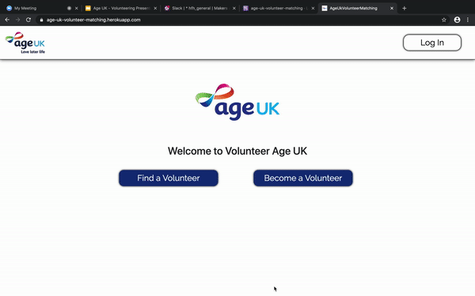

Age UK Volunteer Matching Service
===================

This app was developed over the course of three days for the **Hack for Heroes** hackathon hosted by Makers Academy. Developers of the app were: |  [Daria Thompson](https://github.com/dariathompson) | [David Stewart](https://github.com/DavidStewartLDN) |  [Kate Haffenden](https://github.com/naeglinghaff) | [Lila Walker](https://github.com/lilawalker) | [Patrick Oliver](https://github.com/poliver24) | [Stephan Ellenberger](https://github.com/stellenberger) | [Tom Ratcliffe](https://github.com/ratcliffetj)

Special thanks to [Ben Gittins](https://github.com/squareben1) and [Karlo de Guzman](https://github.com/Kdeg0040) for their contributions at the start of the project.

**Hack for Heroes:** This project won second prize in the hackathon. The challenge was to build ground-breaking projects to support key workers on the frontline.\
\
**The Brief:** This was contributed to the Hackathon by an Age UK employee. Essentially, create an app that allows seniors and volunteers to match based on mutual interests and hobbies. Similar to a dating app but optimised for users that may be less tech savvy. The profiles should include name, some details about the person and what their interests are.\
\
**Presentation Video:** Check out the full [presentation](https://www.youtube.com/watch?v=tafnwcPW1Io) of our app, starting at minute 4:00.\
\
[Getting Started](#getting-started) | [Dependencies](#dependencies) | [Deployment](#deployment) | [Criteria for Building the Project](#criteria-for-building-the-project) | [App Demo](#app-demo)

## Getting Started

Ensure you have the following setup on your machine:
- Bundle
- Yarn
- PostgreSQL
- ImageMagick

`git clone` this repository and `cd` into the directory.

Install dependencies:

```
$ bundle install
```

Create, migrate and seed the database:

```
$ rails db:setup
```

To run the project, start up the server:

```
$ rails server
```

Then navigate to `localhost:3000` in your browser


## Dependencies

This project relies on the following Rails Gems:

- Devise (for user authentication)
- CarrierWave (for image uploading)
- Fog-AWS (for image storage)

## Deployment

**Our app is deployed via Heroku: [click here](https://age-uk-volunteer-matching.herokuapp.com/)**

To setup your own deployment, first create an app on [Heroku](https://www.heroku.com/)

Then setup image storage:

- Set up an [AWS S3 account](https://aws.amazon.com/s3/)
- Create a bucket in S3
- Get your S3 access key id and secret access key

Add the following keys to Heroku - [see instrtuctions](https://devcenter.heroku.com/articles/config-vars)

```
S3_KEY=<your-access-key-id>
S3_SECRET=<your-secret-access-key>
S3_BUCKET=<your-bucket-name>
```

## Criteria for Building the Project

#### Domain Model

| Models | Methods | State |
| :--- |:--- | :--- |
| User | sign_up, log_in, log_out  | email, password, volunteer(boolean), name, telephone, location, bio, image |
| Interest | | name |
| UserInterests | | user_id, interest_id |
| Matches | | user_id, volunteer_id |


#### User Stories

```
As a user
So that I can connect with volunteers
I would like to sign up to Age UK Volunteer Matching

As a user
So that I can tell volunteers what I'm interested in
I would like to choose my interests from a selection during the sign up stage

As a user
So that I can match with volunteers
I would like to see a list of volunteers with similar interests

As a user
So that I can choose who to share my contact details with
I would like to select the match whom I want to connect with

As a volunteer
So that I can help out users
I would like to sign up to Age UK Volunteer Matching

As a voluteer
So that I can tell volunteers what I'm interested in
I would like to choose my interests from a selection during the sign up stage

As a volunteer
So that I can connect with matches
I would like to receive a notification containing my match's contact details
```

## App Demo


